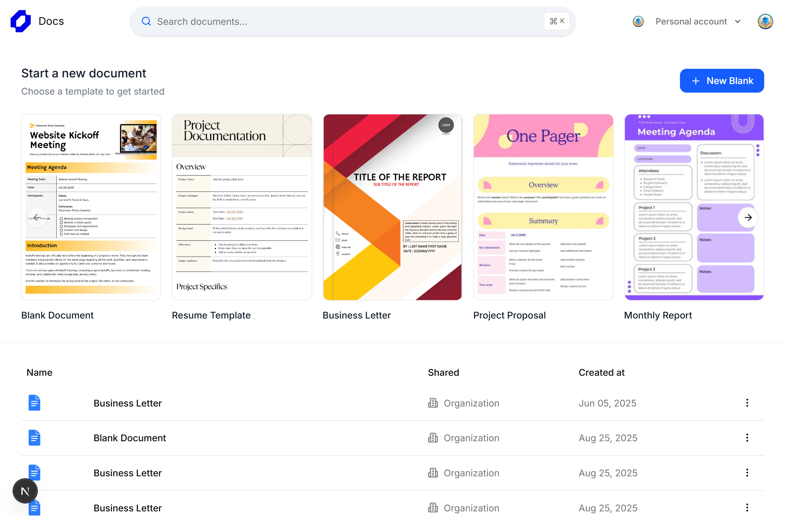

# Google Docs Clone ✍️  



A **real-time collaborative Google Docs clone** built with **Next.js, Clerk Authentication, Liveblocks, and Tiptap editor**.  
Multiple users can edit documents simultaneously with live cursors, text formatting, tables, tasks, and more — just like Google Docs.

---

## 🚀 Features

- 🔑 **Authentication & User Management** – Powered by Clerk  
- 👥 **Live Collaboration** – Real-time updates using Liveblocks & Yjs  
- ✨ **Rich Text Editing** – Tiptap editor with formatting, tables, tasks, images, and more  
- 🖊️ **Live Cursors & Presence** – See who’s editing and where in the document  
- 📂 **Document Management** – Create, edit, and share multiple documents  
- 🎨 **Custom Themes** – TailwindCSS for a modern UI/UX  

---

## 🛠️ Tech Stack

- **Frontend**: Next.js 15, React 19, TypeScript, TailwindCSS  
- **Collaboration**: Liveblocks, Yjs, Tiptap  
- **Auth**: Clerk  
- **State Management**: Zustand  
- **UI Components**: Radix UI, Shadcn, Lucide React  

---

## ⚡ Getting Started

### 1️⃣ Clone the repository
```bash
git clone https://github.com/yourusername/docs-clone.git
cd docs-clone
````

### 2️⃣ Install dependencies

```bash
npm install
```

### 3️⃣ Add environment variables

Create a `.env.local` file and add:

```env
CONVEX_DEPLOYMENT=
NEXT_PUBLIC_CONVEX_URL=
NEXT_PUBLIC_CLERK_PUBLISHABLE_KEY=
CLERK_SECRET_KEY=
LIVEBLOCKS_SECRET_KEY=
```

### 4️⃣ Run the development server

```bash
npm run dev
```

### 4️⃣ Run the convex 

```bash
npx convex dev
```

Your app should now be running at [http://localhost:3000](http://localhost:3000) 🚀

---

## 👨‍💻 Author

* Abdul Rehman – [LinkedIn](https://www.linkedin.com/in/rehman-nry/)

---

## 📜 License

This project is open-source and available under the **MIT License**.